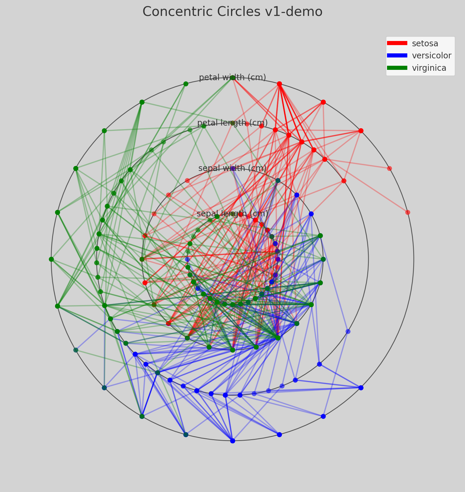
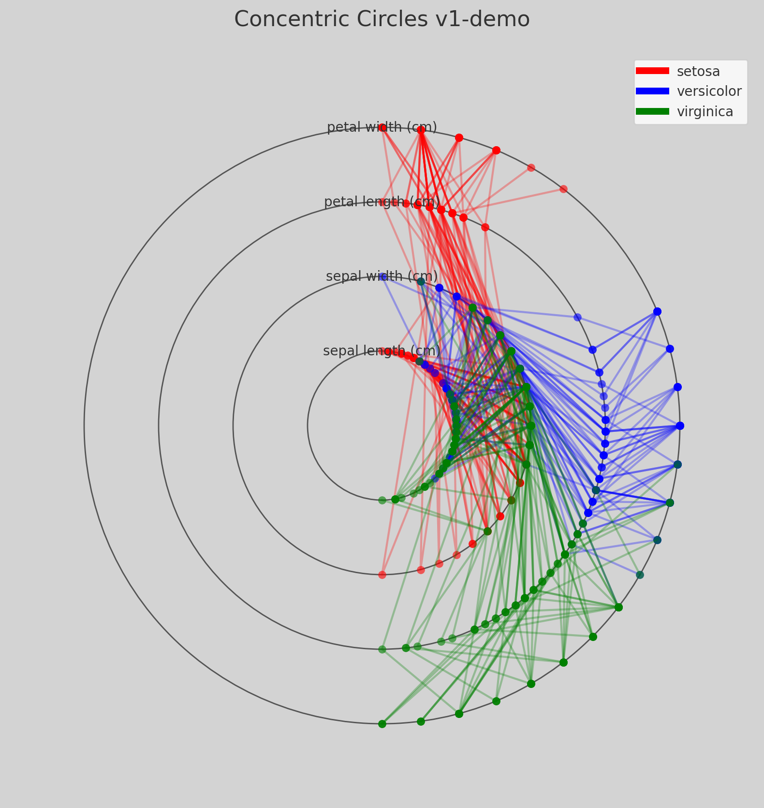
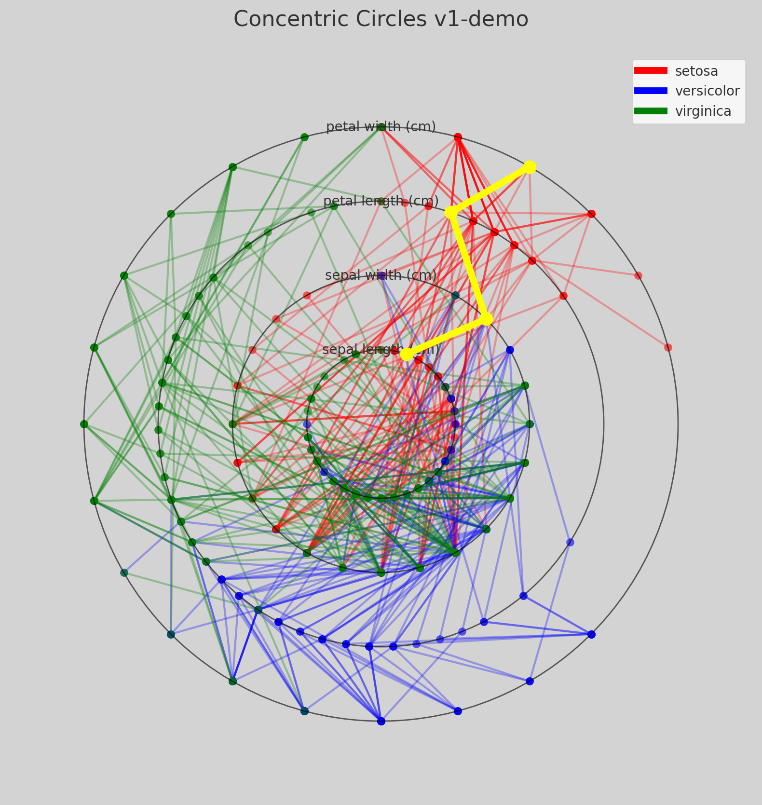
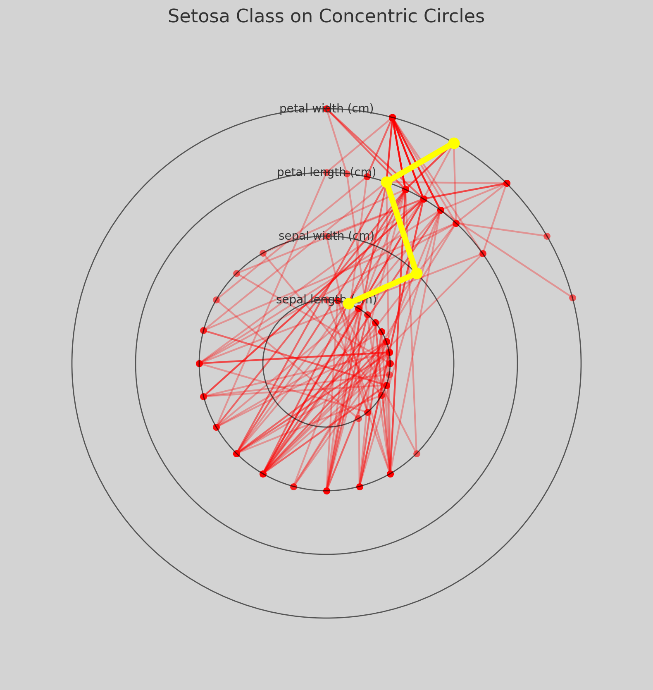

# ConcentricCircleGLC

Experiments with a new General Line Coordinate mapping which is currently being explored utilizing Concentric Circle axes. Generalizes the concept of Parallel Coordinates mapped onto concentric circles.

## Screenshots

## License

This project is freely available for personal and commercial use under the MIT license, please see `LICENSE` for full details.
