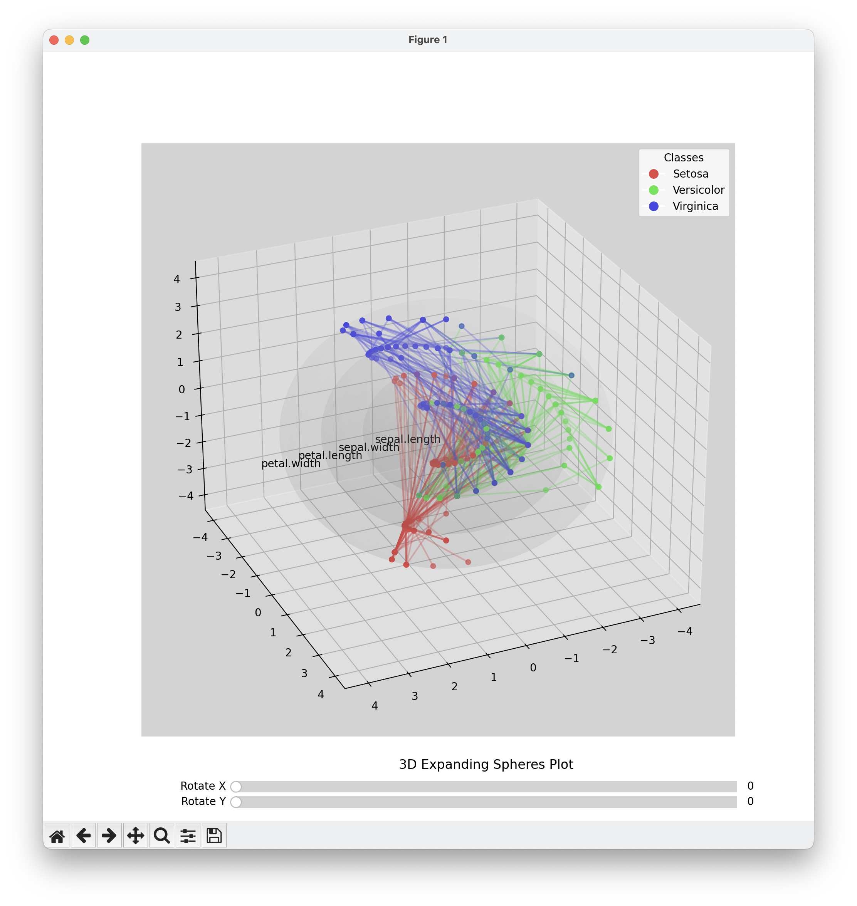

# ConcentricCircleGLC

Experiments with two new General Line Coordinate mappings which is being developed on Concentric Circle and Concentric Spheres axes. Generalizes the concept of Parallel Coordinates mapped onto 2D and 3D sequenced and enclosed axes.

## Screenshots

## License

This project is freely available for personal and commercial use under the MIT license, please see `LICENSE` for full details.
